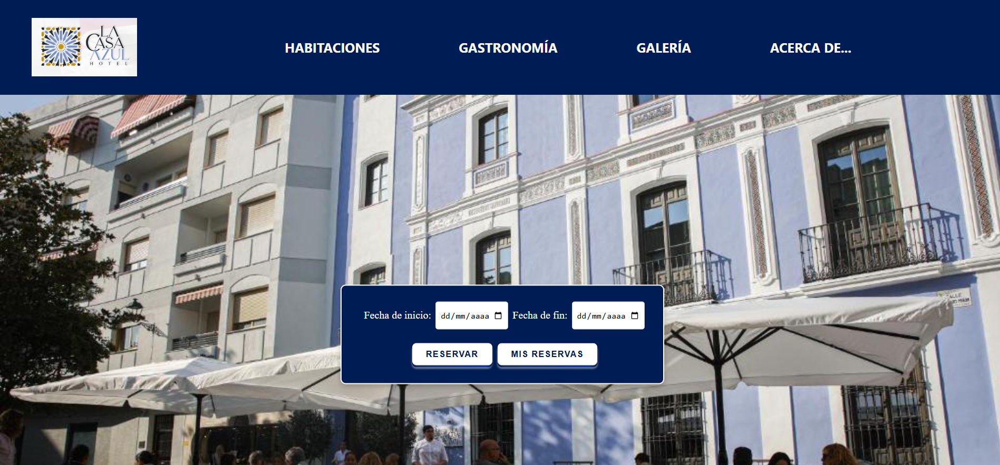
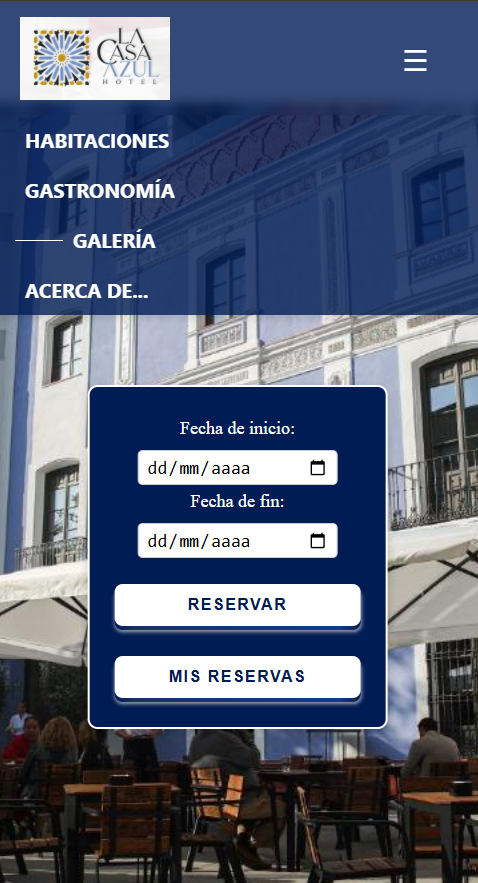
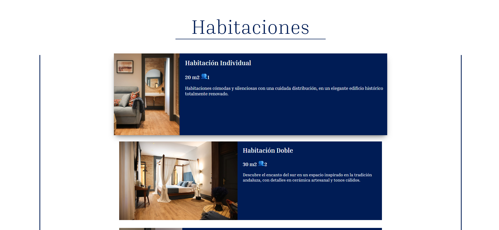
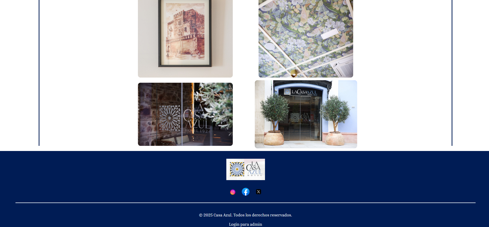

# Proyecto Integrado - Hotel Casa Azul

Este proyecto ha sido desarrollado como parte del módulo de Proyecto Integrado del segundo curso del Ciclo Formativo de Grado Superior en Desarrollo de Aplicaciones Web (2º DAW). Bajo la tutela del profesor Manuel Arroyo Juan, los alumnos Jaime Araque Ruíz, Juan Manuel García Flores y Rafael Martínez Torralba han diseñado y construido una solución web completa para la gestión interna del Hotel Casa Azul.

El objetivo principal del proyecto es ofrecer una herramienta digital que facilite al personal del hotel la administración de clientes, reservas, habitaciones y pagos, mejorando así la eficiencia operativa y la experiencia del cliente. La plataforma está compuesta por un frontend desarrollado en **Vue.js**, un backend basado en **Java con Spring Boot**, y una base de datos **MySQL** que garantiza el almacenamiento estructurado y persistente de toda la información.

Gracias a esta solución, el Hotel Casa Azul puede automatizar tareas clave, reducir errores administrativos y ofrecer un servicio más moderno, profesional y accesible desde cualquier dispositivo con conexión a internet.

Este repositorio contiene todo el código fuente, documentación y detalles técnicos del sistema desarrollado.

# Manual para su instalación y ejecución

## BACKEND (SpringBoot)

### Requisitos Previos:
- Java 17 o superior
- Maven
- Spring Boot

### Descarga del Proyecto:
git clone https://github.com/IESJandula/hotel_casa_azul.git

cd Back-CasaAzul

### Configuración de la Base de Datos (MySQL):
Edita el fichero application.properties:

spring.datasource.url=jdbc:mysql://localhost:3306/hotel

spring.datasource.username=hotel

spring.datasource.password=1234

### Después ejecuta el proyecto.
El backend se iniciará en:
http://localhost:8080

## Frontend (Vue)

### Requisitos Previos:
- NPM (el gestor de paquetes incluido con Node.js) para instalar las dependencias del proyecto y ejecutar los scripts de construcción y arranque.

### Proceso de instalación y ejecución:
Clona el repositorio.

cd Front-CasaAzul

Instala las dependencias:
     npm install
### Ejecuta el proyecto:
     npm run dev

El frontend se iniciará en:
http://localhost:5173

# Galería

